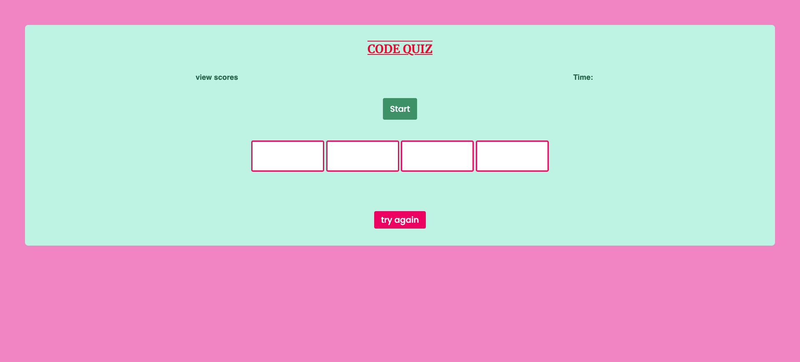

# Code Quiz - Challenge 04

## Description

Developed a javascript codebase which creates a random password based on user selected parameters. 

Developed a javascript codebase which formulates a quiz to test on javascript knowledge. 

- the user should be able to click start
- a timer will run after start, counting down to 0 and/or subtracting 5 score points if a incorrect answer is selected
- when the game is over, the user will be able to enter their name or initials and save their score to their local storage
- the user can click a link to view all available local scores

## Usage

File can used and shared to create more test javascript knowledge or expand upon as needed. 

## License

- GitHub repository URL: https://github.com/cherah-petra/CP-Code-Quiz-C04
- GitHub Page: https://cherah-petra.github.io/CP-Code-Quiz-C04/
- License: license.txt

